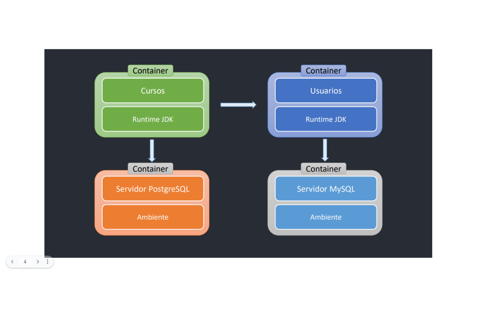
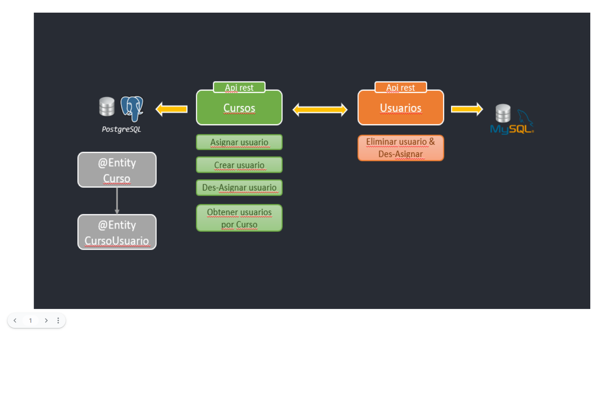
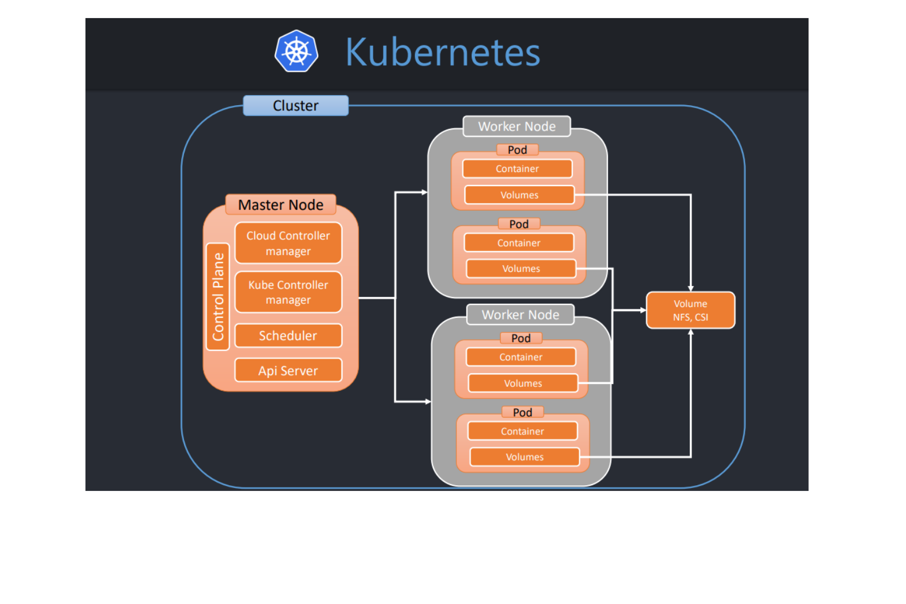
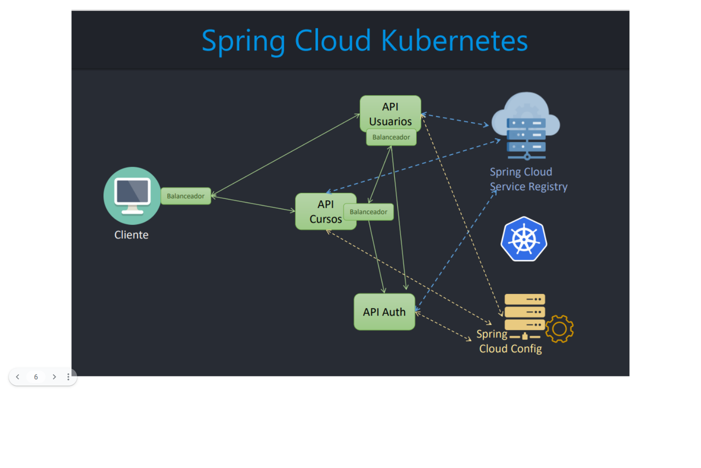
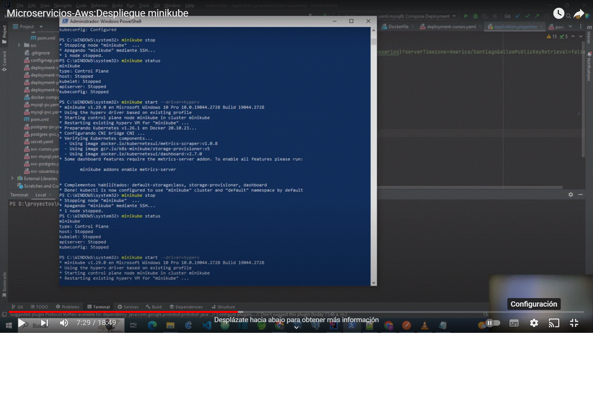

# msvc-kubernetes-aws
msvc-kubernetes-aws

The intention of the project is to address a use with kubernetes.
4 microservices are used in didactive mode, to carry out the deployment in minikube and AWS-EKS. 
Docker-Kubernetes-FeingClient-SpringCloudKubernetes

4 microservices were used 

The microservices have two separate databases, and they communicate with each other by FeingClient.

The persistent volume was used to save the data from the databases.

Spring Cloud Kubernetes was used to communicate with Kubernetes from Spring.

Demo Deploy Minikube

Demo Deploy aws-eks
