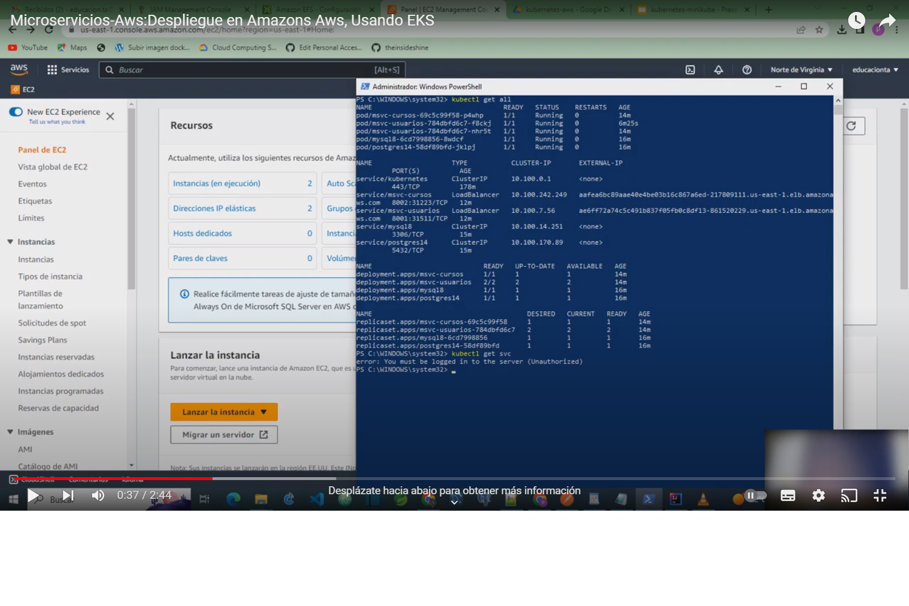

# msvc-kubernetes-aws
msvc-kubernetes-aws

The intention of the project is to address a use with kubernetes.
4 microservices are used in didactive mode, to carry out the deployment in minikube and AWS-EKS. 
Docker-Kubernetes-FeingClient-SpringCloudKubernetes

4 microservices were used 

